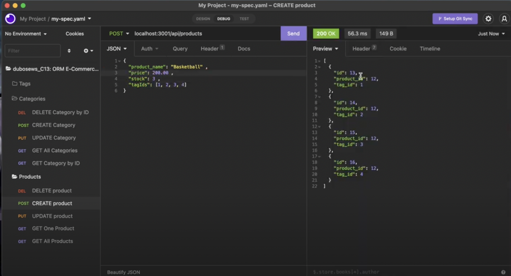

# 13: ORM E-Commerce Back End (API)
</img>
<br>

## Table of Contents <br />
  1. [Description](#description) 
  2. [Installation](#installation)
  3. [Usage](#usage)  
  4. [Contributing](#contributing)
  5. [Tests](#tests)
  6. [License](#license)
  7. [Questions](#questions)
  8. [E-mail](#e-mail)
  9. [Walkthrough](#walkthrough)

## Description <br />
This application is a working back end server that can host an ecommerce website and the different requests that the owners and users would need to make from the server. It has routes for [CREATING, UPDATING, READING, DELETING]. There is no front end for the application built so the routes are going to be demonstrated in the walkthrough video. This project uses the following packages: 1.) dotenv: this package is used to store sensitive server information in a separate file that can be included in the .gitignore file when pushing the repo to Github. 2.)express.js: self explanitory. 3.) mysql2: is used for a part of this application as well, apparently. See WALKTHROUGH VIDEO for more. 

## Installation <br />
To install this application you need to open the root folder of the repository in the command line, once you have navigated to the directory, you type in the following script to install the application: ```npm install```

## Usage <br />
To use the application, very similarly to how it is installed, you must operate in the command line tool. Navigate the active command line to the application directory where the node_modules were installed. *** WARNING *** . This application will not work properly without the necissary packages installed, refer to the "INSTALL" section of this README to get the script to install before trying to run this application. Assuming the installation process has been completed and the command line is in the application root directory, to start the server application, please enter the following script into the command line: ```node server.js```

## Contributing <br />
If you feel the need to contribute to this project, feel free to leave feedback in the Github repository, which will be linked below. 

## Tests <br />
The walkthrough video demonstrates how to use the "INSOMNIA" application to store route requests and then test them after the server has been started.

## License <br />
 

## Questions <br />
* Github Profile: [dubosews](https://github.com/dubosews) <br /><br />
* Contact Email: [wsd10205@gmail.com](mailto:wsd10205@gmail.com) <br /><br />
* Directions for reaching out with further questions:<br />
    Becuase of the incredibly large amount of marketing and spam emails that I recieve, It is very easy for important emails to slip through the cracks, the best way to reach out is through the Github repository. 


## Walkthrough <br />
* Youtube Video: https://youtu.be/oKmDgXZlGDI